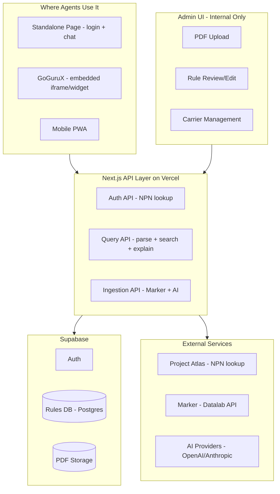
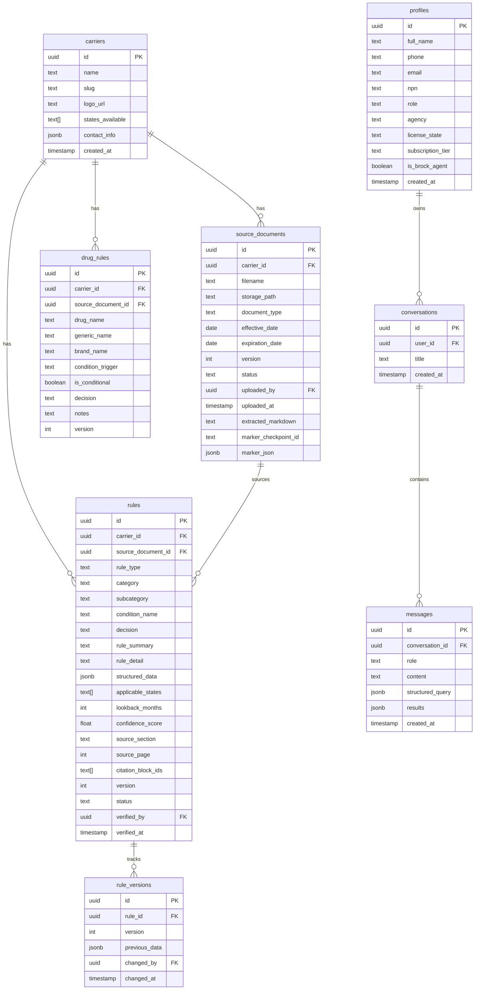
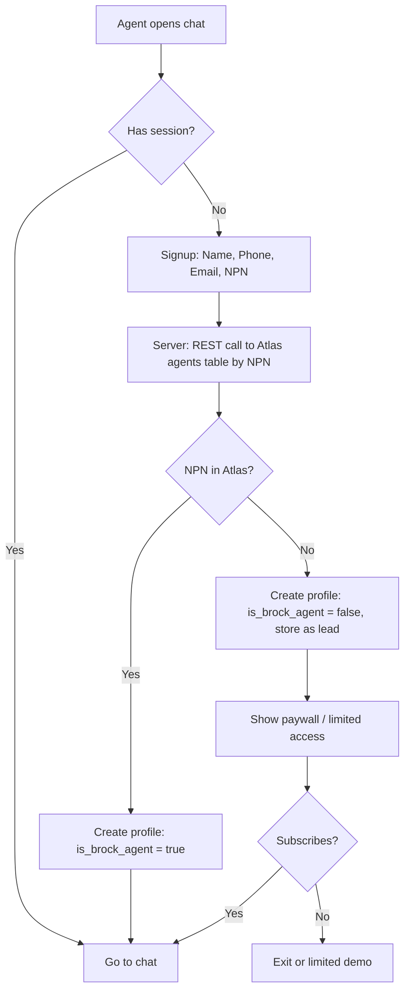

# Brok UW -- Medicare Supplement Underwriting Chatbot

## Core Concept

This is a **chatbot backed by a rules database**, not a website with a chatbot bolted on. The agent-facing product is a single chat interface. Everything else is backend (API, rules DB, extraction pipeline) or internal tooling (admin UI).

The chat can:

- Run standalone at its own URL (login + chat, that's it)
- Embed into GoGuruX or any other tool via iframe or JS widget
- Work as a responsive PWA on mobile

## Architecture Overview




## Tech Stack

- **Framework**: Next.js 15 (App Router) -- hosts the API, admin UI, and standalone chat page
- **Database**: Supabase (Postgres + Auth + Storage + RLS)
- **Chat UI**: React component with Tailwind + shadcn/ui -- designed as a self-contained widget
- **PDF Extraction**: Marker via Datalab API (structured extraction with JSON schemas + citation tracking)
- **AI**: Provider-agnostic abstraction (OpenAI + Anthropic adapters) -- query parsing, result explanation, extraction refinement
- **Deployment**: Vercel
- **Embedding**: iframe-ready route + optional JS embed script

## What the Agent Sees

The entire agent-facing product is **one screen**: a chat interface. No dashboard, no sidebar nav, no settings pages. Just:

1. **Login** (first visit): Name, Phone, Email, NPN -- one form, one button
2. **Chat** (every visit after): Full-screen conversational interface

Inside the chat, the agent can:

- Type a scenario in plain English: *"65-year-old female in Texas, has atrial fibrillation, takes Eliquis"*
- Or use a guided intake when prompted: the bot asks structured questions one at a time (state, Medicare status, conditions, medications, height/weight)
- Get back **rich inline result cards** -- not a separate "results page," just cards rendered in the chat:
  - Per-carrier verdict (green/yellow/red) with confidence
  - Knockout flags with the specific condition + citation
  - Lookback periods and conditional notes
  - Follow-up questions to ask the client
  - "Compare carriers" expandable section
  - Citation: source document, page, section, effective date
- Every response includes a disclaimer footer
- Conversation context persists within a session so agents can ask follow-ups: *"What about if she stopped Eliquis 6 months ago?"*

```
+-----------------------------------------------+
|  Brok UW          [disclaimer banner]    [logout]|
+-----------------------------------------------+
|                                               |
|  Bot: Hi! Describe your client's situation,   |
|  or I can walk you through it step by step.   |
|  [Type a scenario] [Guided intake]            |
|                                               |
|  You: 72yo male in Ohio, has COPD, takes      |
|  Combivent and Symbicort, 5'10" 195 lbs       |
|                                               |
|  Bot: Here's what I found across 14 carriers: |
|                                               |
|  +------------------------------------------+ |
|  | AETNA                          DECLINE  | |
|  | Knockout: COPD is a Section 3 auto-      | |
|  | decline condition.                        | |
|  | Source: Aetna UW Guide, p.9, eff. 11/2015| |
|  +------------------------------------------+ |
|  | HUMANA                         DECLINE  | |
|  | Knockout: COPD listed as ineligible       | |
|  | condition. Combivent on drug decline list. | |
|  | Source: Humana UW Guide, p.8, eff. 11/2018| |
|  +------------------------------------------+ |
|  | ANTHEM                         DECLINE  | |
|  | Knockout: Combivent triggers auto-denial   | |
|  | for COPD. Symbicort not separately listed. | |
|  | Source: Anthem UW Guide, p.16, eff. 08/2024|
|  +------------------------------------------+ |
|  | ... [Show all 14 carriers]                | |
|  |                                           | |
|  | [Compare carriers side-by-side]           | |
|  |                                           | |
|  | This guidance is informational only.       | |
|  | Always confirm with the carrier.           | |
|  +------------------------------------------+ |
|                                               |
|  [Type follow-up question...]                 |
+-----------------------------------------------+
```

## Embedding in GoGuruX

Since GoGuruX is React + Vite (not Next.js), the cleanest embed options:

**Option A -- iframe (simplest, works today):**
The standalone chat page at `/chat` is designed to work in an iframe. GoGuruX adds:

```html
<iframe src="https://brok-uw.vercel.app/chat?embed=true&token={session_token}" />
```

The `embed=true` param hides the outer chrome (header, login). Auth token passed from GoGuruX session.

**Option B -- JS embed script (richer, future):**
A lightweight script tag that mounts the chat widget:

```html
<script src="https://brok-uw.vercel.app/widget.js" data-api-key="..." />
```

Both options call the same Brok-UW API endpoints. The chat component itself is identical.

## Database Schema

(Unchanged from previous plan -- carriers, source_documents, rules, drug_rules, profiles, conversations, messages, rule_versions. See ER diagram below.)




## NPN-Based Auth Flow




- **Cross-project lookup**: REST call from Brok-UW to Project Atlas (`hmshhtolbkzhmkzjcher`) Supabase API: `GET /rest/v1/agents?npn=eq.{npn}&select=id,first_name,last_name,status,states_licensed`
- Atlas `states_licensed` auto-populates agent's profile for state-filtered queries
- Returning users: email + magic link or password
- Env vars: `ATLAS_SUPABASE_URL`, `ATLAS_SUPABASE_SERVICE_ROLE_KEY`

## Extraction Pipeline: Marker + AI

(Unchanged -- Marker Datalab API for PDF conversion + structured JSON extraction with citation tracking, AI for normalization/edge cases only. Three schemas: knockout conditions, drug-condition mappings, process/state/BMI rules.)

## Rule Update & Versioning

(Unchanged -- admin uploads new version, Marker re-processes, diff engine compares old vs new, admin reviews added/changed/removed rules, approves changeset. Staleness indicators at 10/12 month thresholds.)

## Phased Build

### Phase 1: Foundation + Chat Shell

- Scaffold Next.js project with TypeScript, Tailwind, shadcn/ui
- Create Supabase project, run all DB migrations, set up RLS + Storage bucket
- NPN-based auth flow (signup form + Atlas cross-project lookup)
- **Build the chat page**: full-screen chat UI at `/chat`, responsive, disclaimer banner, login gate
- The chat page is the product. No dashboard, no marketing page, no settings.
- `.env.local.example` with: `NEXT_PUBLIC_SUPABASE_URL`, `NEXT_PUBLIC_SUPABASE_ANON_KEY`, `SUPABASE_SERVICE_ROLE_KEY`, `ATLAS_SUPABASE_URL`, `ATLAS_SUPABASE_SERVICE_ROLE_KEY`, `DATALAB_API_KEY`, `OPENAI_API_KEY`, `ANTHROPIC_API_KEY`, `AI_PROVIDER`

### Phase 2: Admin Ingestion Pipeline

- PDF upload UI (admin-only route)
- Marker extraction pipeline (convert + 3x structured extract + AI normalize)
- Admin rule review UI (pending rules, inline edit, approve/reject, version tracking)
- Carrier management (add/edit carriers, state availability)
- Batch-ingest all 31 existing PDFs + 1 DOCX
- Update/re-ingestion workflow with diff engine
- Staleness dashboard

### Phase 3: Query Engine + Chat Polish

- **Query API**: AI parses NL to structured query, Postgres rules search, ranking + confidence, AI explains results with "why" bullets and citations
- **Guided intake in chat**: bot asks structured questions inline (state, conditions, meds, height/weight) instead of a separate form
- **Rich result cards**: knockout flags, conditional warnings, citations, follow-up questions, carrier comparison -- all rendered inline in the chat
- **Embed mode**: `/chat?embed=true` strips outer chrome for iframe use in GoGuruX
- **Session context**: follow-up questions work without restating the whole scenario

### Phase 4: Embed, Privacy, Mobile

- JS embed script (`widget.js`) for drop-in embedding
- Privacy controls (ephemeral prompts, PHI-free logging, server-side AI only)
- Audit logging
- PWA manifest + service worker for mobile home-screen install
- Subscription gate stubs (paywall for non-Brock agents)

## File Structure

```
src/
  app/
    page.tsx                    -- Redirects to /chat
    chat/
      page.tsx                  -- THE product: login gate + chat interface
      layout.tsx                -- Minimal: disclaimer banner, responsive shell
    (admin)/
      layout.tsx                -- Admin layout with nav
      page.tsx                  -- Admin overview + staleness dashboard
      documents/page.tsx        -- Upload + manage PDFs
      rules/page.tsx            -- Review + edit rules
      rules/[id]/page.tsx       -- Single rule editor
      carriers/page.tsx         -- Carrier management
      drugs/page.tsx            -- Drug rules management
    api/
      auth/signup/route.ts      -- NPN lookup + account creation
      query/route.ts            -- Main query endpoint (NL -> results)
      query/guided/route.ts     -- Guided intake step-by-step
      extract/route.ts          -- Trigger Marker extraction (admin)
      rules/route.ts            -- CRUD for rules (admin)
  components/
    ui/                         -- shadcn components
    chat/
      chat-container.tsx        -- Main chat wrapper (manages conversation state)
      message-list.tsx          -- Scrollable message area
      message-bubble.tsx        -- Single message (user or bot)
      chat-input.tsx            -- Input bar with send button
      guided-intake.tsx         -- Inline guided questions within chat
    results/
      carrier-result-card.tsx   -- Per-carrier verdict card (inline in chat)
      knockout-badge.tsx        -- Red knockout indicator
      confidence-indicator.tsx  -- Confidence bar/score
      citation-block.tsx        -- Source doc + page + effective date
      comparison-view.tsx       -- Side-by-side carrier comparison
    admin/
      pdf-uploader.tsx
      rule-review-table.tsx
      rule-editor.tsx
  lib/
    marker/
      client.ts
      schemas/
        knockout.ts
        drugs.ts
        process-rules.ts
      types.ts
    ai/
      providers/
        openai.ts
        anthropic.ts
        types.ts
      prompts/
        normalize-rules.ts
        parse-query.ts
        explain-results.ts
        compare-carriers.ts
      index.ts
    supabase/
      client.ts
      server.ts
      middleware.ts
    db/
      queries/
        rules.ts
        drugs.ts
        carriers.ts
        conversations.ts
    utils/
      rule-matcher.ts
      confidence-scorer.ts
      atlas-lookup.ts           -- Cross-project NPN check
  types/
    database.ts
    rules.ts
    ai.ts
```

## Key Risk Mitigations

- **AI does NOT make underwriting decisions** -- it only parses queries and explains DB results
- **Every AI extraction is human-verified** before rules go live
- **Version control on all rules** -- full audit trail
- **Ephemeral prompt storage** -- health details auto-purge
- **Persistent disclaimers** -- cannot be dismissed, appear on every response

